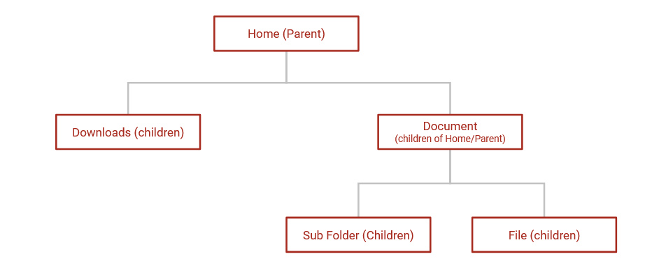
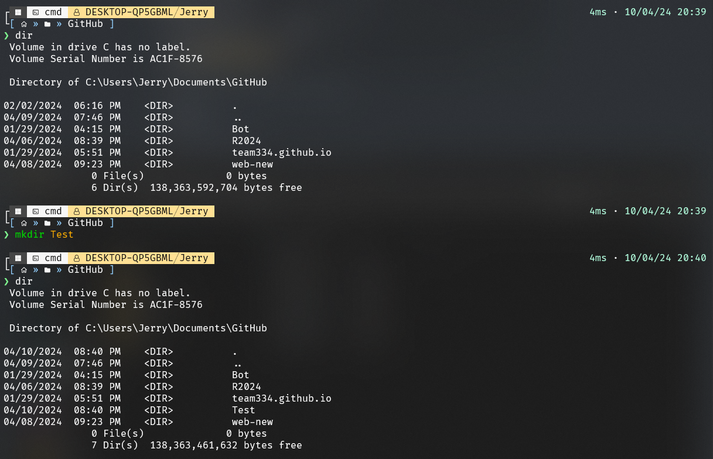
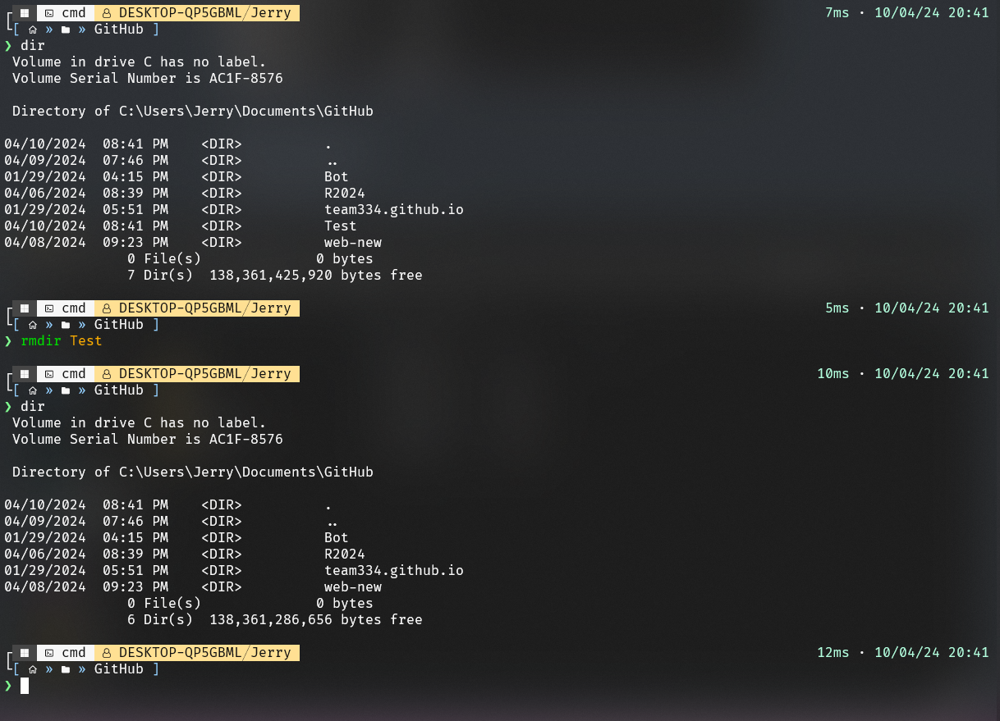

# Learning the Command Line

> It's just a space where people input a command and executes the input/command and returns it to the user

| Tools Needed | Downloads            |
| ------------ | -------------------- |
| Git          | https://git-scm.com/ |

Now there are many types of terminals/command line s

| OS      | Terminal       |
| ------- | -------------- |
| MacOS   | [Bash](https://www.gnu.org/software/bash/)           |
| Linux   | [Zsh](https://www.zsh.org/)/[Bash](https://www.gnu.org/software/bash)       |
| Windows | [Cmd](https://learn.microsoft.com/en-us/windows-server/administration/windows-commands/cmd)/[Powershell](https://learn.microsoft.com/en-us/powershell/) |

>  You can also Git bash

## Directories

## 

We have our parent directory which is `Home` and inside the directory we have 2 folders those are children of the `Home` directory. Inside the `Document` Folder which has 2 has a folder and a file. The 2 are both children of `Document` folder.

### Understanding Structure

In some cases because `Home` is the parent directory that means we can put `/` to specify that is the parent directory. To get to the `Download` Folder we need to go to `/Downloads/` and if we want to go to `Sub Folder` we have go to `/Documents/Sub Folder`.

> Note: In some cases parent directory can be specify like this `./`

If I'm in `Document` Folder and I want to be in `Home` I have to go back so `../` That just means parent folder

## Commands

In most operating system they use `cd` and `ls`. 

For Windows you need to use `dir`. You can also use `tree` but that only applies to windows.

> **[...] means optional parameter and (...) is required parameter**

### ls [dir] or dir [dir]

> List directory

The command line can display all the contents of a displays all files and folders in current directory.

> MacOS/Linux

This is `Git bash` works just like MacOS/Linux

> Windows

> My Command line has transparency btw

### cd (dir)

> Change directory

Changes the directory that the terminal is working on

### mkdir (dirname)

> Make directory

Make directory on the current directory

## rmdir (dirname)

> Delete directory

Delete a directory in the current directory

)
